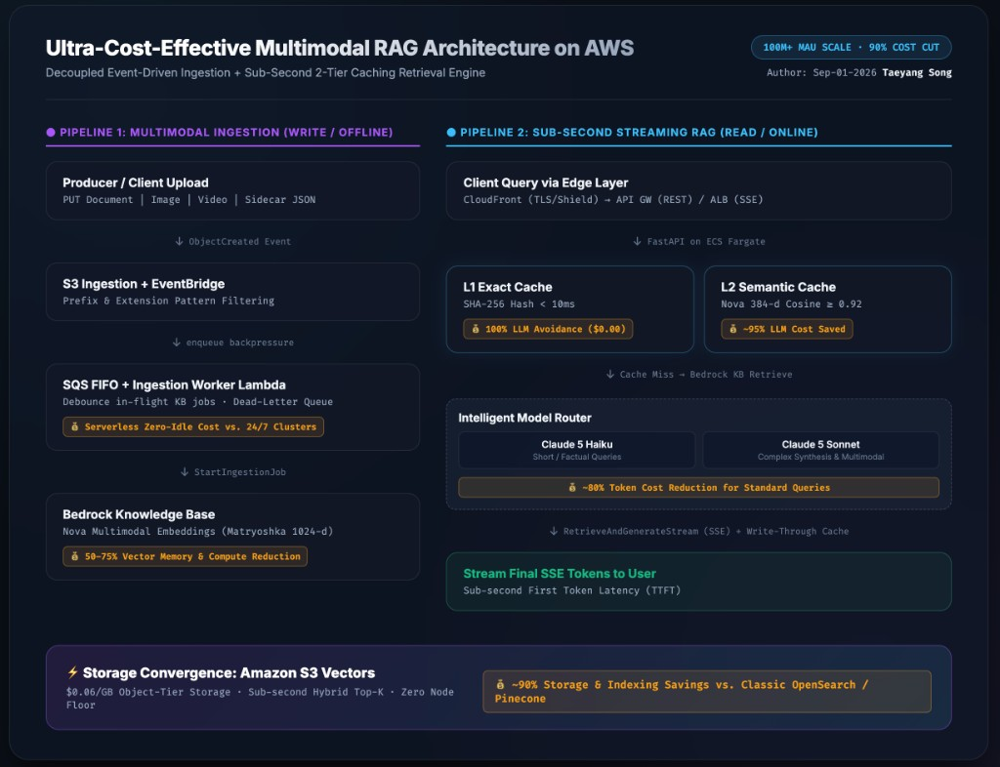
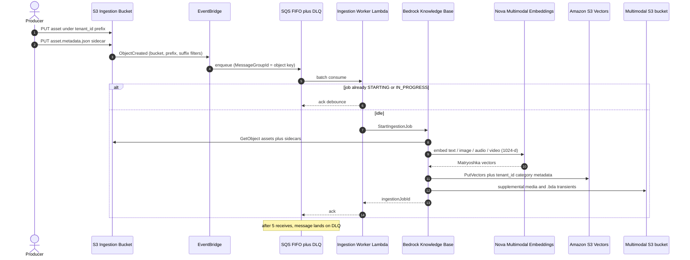
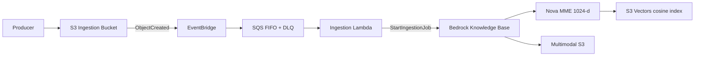
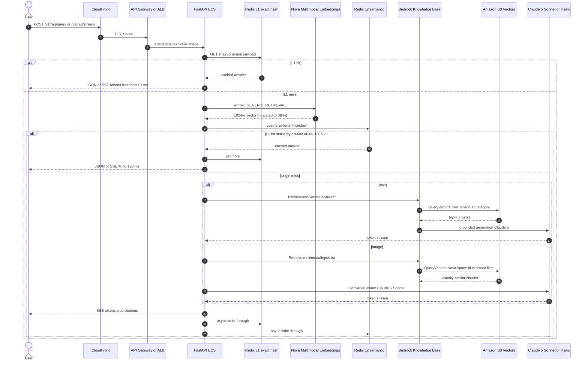
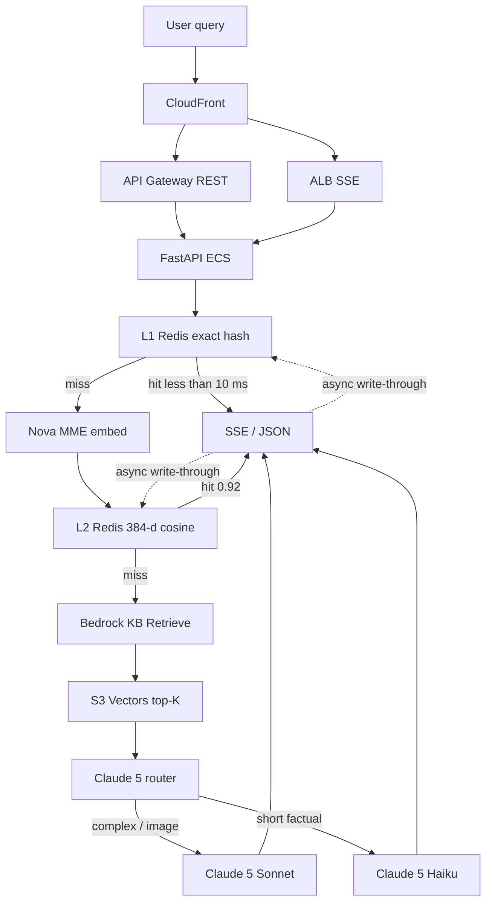

# Scalable Multimodal RAG on Amazon Bedrock Knowledge Bases + S3 Vectors



Production-ready multimodal Retrieval-Augmented Generation (RAG) for **100M+ monthly active users**. The platform is two independent pipelines that share one vector store:

| Pipeline | Path | Cadence | Job |
| --- | --- | --- | --- |
| **1. Ingestion & embedding** | Write / offline | Asynchronous (seconds–minutes) | Land multimodal assets, embed with Nova, index into S3 Vectors |
| **2. Query & RAG** | Read / online | Real-time (sub-10 ms cache → sub-second origin TTFT) | Two-tier Redis cache, retrieve from S3 Vectors, stream Claude 5 tokens |

**Vector store:** Amazon S3 Vectors (up to ~90% lower indexing / storage / query cost than specialized vector databases). **Embeddings:** Amazon Nova Multimodal Embeddings (`amazon.nova-2-multimodal-embeddings-v1:0`) — one Matryoshka space for text, images, documents, audio, and video. **LLM engine:** Anthropic **Claude 5 Sonnet** for deep reasoning and **Claude 5 Haiku** (fast/cost tier) via intelligent prompt routing.

> This README is the single architecture and operations reference.

---

## Table of contents

1. [Model catalog](#model-catalog)
2. [End-to-end visual map](#end-to-end-visual-map)
3. [Where the money is saved](#where-the-money-is-saved-cost-drivers-breakdown)
4. [Pipeline 1 — Ingestion & embedding (write path)](#pipeline-1--asynchronous-multimodal-ingestion--embedding-write--offline-path)
5. [Pipeline 2 — Query & RAG (read path)](#pipeline-2--real-time-multi-tier-rag-query-read--online-path)
6. [Architectural principles](#architectural-principles)
7. [Control-plane topology](#control-plane-topology)
8. [100M+ MAU traffic sizing](#100m-mau-traffic-sizing)
9. [Latency profile](#latency-profile)
10. [TCO comparison](#tco-comparison-s3-vectors--bedrock-kb-vs-opensearch-serverless-vs-pinecone)
11. [Trade-off analysis](#trade-off-analysis)
12. [Resilience](#resilience)
13. [Project structure](#project-structure)
14. [Quickstart](#quickstart)
15. [API specification](#api-specification)
16. [Ingestion contract](#ingestion-contract)
17. [Local development](#local-development)
18. [Security](#security)
19. [100M launch checklist](#100m-launch-checklist)

---

## Model catalog

| Role | Family | Bedrock ID (this repo) | When it runs |
| --- | --- | --- | --- |
| Embedding | Amazon Nova Multimodal Embeddings | `amazon.nova-2-multimodal-embeddings-v1:0` | Ingestion (index) and L2 cache / retrieve (query). Matryoshka sizes **256 / 384 / 1024 / 3072**. Index default **1024-d**; L2 cache prefix **384-d**. |
| Deep reasoning / synthesis | **Claude 5 Sonnet** | Geo profile `us.anthropic.claude-sonnet-5` (base `anthropic.claude-sonnet-5`) | Image queries, long prompts, compare / analyze / design. |
| Rapid / cost-efficient | **Claude 5 Haiku** (fast tier) | Geo profile `us.anthropic.claude-haiku-4-5` (base `anthropic.claude-haiku-4-5`) | Short factual text. Bedrock’s Haiku SKU in the Claude 5 generation stack. |
| Optional override | Bedrock intelligent prompt router | `BEDROCK_PROMPT_ROUTER_ARN` | Replaces local heuristics when set. |

Nova does **not** expose a native 512-d Matryoshka cut. Use **384-d** (cheaper cache) or **1024-d** (index / higher recall). Truncation is always from the leading dimensions, then L2-normalized.

---

## End-to-end visual map

Write path is the **top** rail. Read path is the **bottom** rail. They meet only at **Amazon S3 Vectors**. `[💰]` badges mark **where** money is saved versus a traditional always-on RAG stack (OpenSearch / Pinecone + full-dimension vectors + every-query LLM).

```
╔══════════════════════════════════════════════════════════════════════════════════════════╗
║  PIPELINE 1  ·  WRITE / OFFLINE                                                          ║
║  Asynchronous multimodal ingestion & S3 Vectors indexing                                 ║
║                                                                                          ║
║   Producer / Client                                                                      ║
║        │  PUT document | image | audio | video                                           ║
║        ▼                                                                                 ║
║   ┌─────────────────────┐    ObjectCreated     ┌──────────────┐                          ║
║   │ S3 Ingestion Bucket │ ──────────────────►  │ EventBridge  │                          ║
║   │  {tenant_id}/…      │  prefix + suffix     │  pattern     │                          ║
║   │  + sidecar JSON     │  filter              └──────┬───────┘                          ║
║   └─────────────────────┘                             │ enqueue                          ║
║                                                       ▼                                  ║
║                         ┌─────────────────────────────────────────────┐                  ║
║                         │ SQS FIFO + DLQ  →  Ingestion Worker Lambda  │                  ║
║                         │ backpressure · debounce in-flight KB jobs   │                  ║
║                         │ [💰 Serverless Zero-Idle Cost vs. 24/7      │                  ║
║                         │    Ingestion Clusters]                      │                  ║
║                         └──────────────────────┬──────────────────────┘                  ║
║                                                │ StartIngestionJob                       ║
║                                                ▼                                         ║
║   ┌──────────────────────────────────────────────────────────────────────────────────┐   ║
║   │ Bedrock Knowledge Base                                                           │   ║
║   │  chunk → Nova MME Matryoshka 1024-d (index) / 384-d (cache prefix)               │   ║
║   │  [💰 50–75% Vector Memory & Compute Reduction vs. storing/searching 3072-d]      │   ║
║   └───────────────┬────────────────────────────────────────────────┬─────────────────┘   ║
║                   ▼                                                ▼                     ║
║        ┌────────────────────────────────┐              ┌──────────────────────┐          ║
║        │ Amazon S3 Vectors              │ ◄══ shared ═►│ Multimodal S3 bucket │          ║
║        │ cosine · float32 · ≤2B vec     │    index     │ supplemental media   │          ║
║        │ ~$0.06/GB object-tier pricing  │              │ .bda/ lifecycle      │          ║
║        │ [💰 ~90% Storage & Indexing    │              └──────────────────────┘          ║
║        │    Savings vs. OpenSearch /    │                                                ║
║        │    Pinecone provisioned OCU]   │                                                ║
║        └──────────────┬─────────────────┘                                                ║
╚═══════════════════════╪══════════════════════════════════════════════════════════════════╝
                        │ QueryVectors (tenant_id / category filter)
╔═══════════════════════╪══════════════════════════════════════════════════════════════════╗
║                       ▼                                                                  ║
║  PIPELINE 2  ·  READ / ONLINE                                                            ║
║  Real-time two-tier cache + Claude 5 streaming RAG                                       ║
║                                                                                          ║
║   User (text XOR image Base64/S3 URI)                                                    ║
║        │                                                                                 ║
║        ▼                                                                                 ║
║   CloudFront  ── TLS, HTTP/2, AWS Shield ──►  API Gateway HTTP API  (REST, 30s)          ║
║                                           └►  ALB  (SSE /v1/rag/stream, idle 120s)       ║
║                                                       │                                  ║
║                                                       ▼                                  ║
║                                              FastAPI on ECS Fargate                      ║
║                                                       │                                  ║
║   ┌───────────────────────────────────────────┼──────────────────────────────────────┐   ║
║   │ ① L1  Redis exact SHA-256                 │                                      │   ║
║   │    HIT ──► SSE / JSON                                                            │   ║
║   │    [💰 100% LLM & Retrieval Cost Avoidance | <10ms | $0.00/query]                │   ║
║   │                                                                                  │   ║
║   │ ② L2  Nova 384-d cosine ≥ 0.92            │                                      │   ║
║   │    HIT ──► SSE / JSON                                                            │   ║
║   │    [💰 ~95% LLM Cost Avoidance (Embedding Only) | 40–120ms]                      │   ║
║   │                                                                                  │   ║
║   │ ③ MISS  Bedrock KB → S3 Vectors top-K                                            │   ║
║   │    Intelligent router: Claude 5 Haiku (simple) | Sonnet (complex / image)        │   ║
║   │    [💰 ~80% Token Cost Reduction for Simple/Standard Queries]                    │   ║
║   │    RetrieveAndGenerateStream or Retrieve+Converse  →  SSE + async cache write    │   ║
║   └──────────────────────────────────────────────────────────────────────────────────┘   ║
╚══════════════════════════════════════════════════════════════════════════════════════════╝
```

The pipelines never share compute. Ingestion Lambda cannot serve user queries; Fargate never runs `StartIngestionJob` on the hot path except the operator `/v1/ingest` backfill.

---

## Where the money is saved (cost drivers breakdown)

Reviewers: use this table with the `[💰]` badges above. **Where** = layer. **Why** = what a traditional RAG stack pays for. **How much** = estimated reduction at this architecture’s design point (us-east-1, 2026 list rates; see [TCO comparison](#tco-comparison-s3-vectors--bedrock-kb-vs-opensearch-serverless-vs-pinecone) for the dollar model).

| Layer / Mechanism | Traditional RAG Cost Driver | Our Optimized Architecture | Estimated Savings |
| :--- | :--- | :--- | :--- |
| **Vector Storage** | Provisioned nodes / OCUs (OpenSearch Serverless / Pinecone) running 24/7 | **Amazon S3 Vectors** (serverless object-tier storage, ~$0.06/GB-month, no compute floor) | **~90% reduction** |
| **L1 / L2 Caching** | Every query hits embedding + vector DB + LLM generation | **ElastiCache Redis (exact + semantic)** intercepting 60–70% of traffic (design target 85%) | **~65% total Bedrock cost reduction** at 60–70% intercept; higher if L1 dominates |
| **Model Routing** | Uniformly invoking a top-tier LLM for every origin query | **Intelligent routing** — Claude 5 Haiku for simple/standard text, Claude 5 Sonnet for complex / image | **~50–80% LLM token savings** on the simple/standard share |
| **Embedding Compression** | Full high-dim vectors (3072-d) stored and searched | **Nova Matryoshka truncation** — **1024-d** index (~⅓ the GB of 3072-d); **384-d** L2 cache prefix (native MRL; Nova has no 512-d cut) | **50–75% memory & I/O reduction** vs. 3072-d |
| **Ingestion Compute** | Always-on EC2 / ECS indexing workers | **EventBridge + SQS FIFO + Lambda** — runs only on `Object Created` | **Zero idle compute cost** |

**How to read the map against this table**

| Badge on the map | Layer | Why it saves | How much |
| --- | --- | --- | --- |
| S3 Vectors `[💰 ~90% Storage & Indexing Savings vs. OpenSearch/Pinecone]` | Vector storage | Pay per GB + per query; no OCU / node floor | ~90% vs. Classic OSS / Pinecone at this corpus |
| Nova `[💰 50–75% Vector Memory & Compute Reduction]` | Embedding compression | 1024-d index + 384-d cache vs. 3072-d everywhere | ~67% less vector GB at 1024 vs 3072; ~87% less RAM on L2 at 384 vs 3072 |
| SQS / Lambda `[💰 Serverless Zero-Idle Cost vs. 24/7 Ingestion Clusters]` | Ingestion compute | No worker fleet while the bucket is quiet | Idle = $0 beyond SQS/EventBridge minimums |
| L1 `[💰 100% LLM & Retrieval Cost Avoidance \| <10ms \| $0.00/query]` | L1 cache | Identical hash never reaches Nova, S3 Vectors, or Claude 5 | $0.00 origin; <10 ms |
| L2 `[💰 ~95% LLM Cost Avoidance (Embedding Only) \| 40–120ms]` | L2 cache | Pay Nova embed only; skip retrieve + Claude 5 | ~95% of that query’s LLM+KB bill |
| Router `[💰 ~80% Token Cost Reduction for Simple/Standard Queries]` | Model routing | Haiku on short factual text vs. Sonnet on every miss | ~50–80% tokens on that slice |

At 100M MAU the **largest dollar lever is still cache + routing** (Claude 5 tokens), not the vector store. S3 Vectors makes the remaining origin retrieve cheap; L1/L2 decide how often you pay Claude 5 at all.

---

## Pipeline 1 — Asynchronous multimodal ingestion & embedding (write / offline path)

This is the **write path**. It is eventually consistent, back-pressured, and cheap. Success means: object + sidecar in S3, vectors + filterable metadata in S3 Vectors, supplemental media in the multimodal bucket. It does **not** need to be fast for a human sitting on a request.

### What it does

A producer (app, ETL, or `POST /v1/ingest`) lands a multimodal asset under a tenant prefix. EventBridge watches `Object Created`, SQS FIFO absorbs bursts, and a Lambda worker asks Bedrock Knowledge Bases to chunk, embed with **Nova Multimodal Embeddings**, and persist into **S3 Vectors**. One in-flight Knowledge Base job is enforced so bulk uploads cannot stampede `StartIngestionJob`.

### Numbered flow

1. **Asset upload.** Client/producer PUTs documents, images, audio, or video to the **S3 ingestion (source) bucket** at `{tenant_id}/…`, plus a Bedrock sidecar `{object}.metadata.json` (`tenant_id`, `content_type`, `category`, `created_at`).
2. **Event trigger.** **Amazon EventBridge** captures `Object Created` with pattern filters (bucket name; optionally prefix `tenant_id/` and suffix `.png|.pdf|.mp4|…`). Sidecar `*.metadata.json` objects are ignored by the worker.
3. **Buffering & throttling.** The event is enqueued on **Amazon SQS FIFO + DLQ**. FIFO `MessageGroupId` is the object key (parallel tenants, ordered per object). Visibility timeout covers the Lambda; five failures go to the DLQ.
4. **Worker trigger.** **Ingestion Worker Lambda** consumes the batch (`ReportBatchItemFailures`). If a job is already `STARTING` / `IN_PROGRESS`, it acks and exits (debounce). Otherwise it calls Bedrock `StartIngestionJob`.
5. **Multimodal embedding & storage.** The Knowledge Base chunks content, encodes with **Nova MME** (`amazon.nova-2-multimodal-embeddings-v1:0`, **1024-d** `float32`, cosine), writes vectors and filterable metadata (`tenant_id`, `category`, …) into **Amazon S3 Vectors**, and stores extracted media in the supplemental multimodal bucket (`.bda/` lifecycle = 7 days).

### Diagram 1 — Multimodal data ingestion & S3 Vectors indexing





### Step-by-step data flow (write path)

| Step | Component | Responsibility | I/O payload | Latency SLA |
| --- | --- | --- | --- | --- |
| 1 | S3 ingestion bucket | Durable landing zone, TLS, KMS, versioning | Object bytes + `{key}.metadata.json` | PUT p99 < 200 ms (not on user critical path) |
| 2 | EventBridge | `Object Created` pattern (bucket / prefix / suffix) | EventBridge event `detail.bucket`, `detail.object.key` | Typically < 2 s from PUT to rule match |
| 3 | SQS FIFO + DLQ | Backpressure, per-object ordering, poison isolation | JSON body wrapping the S3 event; DLQ after 5 receives | Queue wait is load-dependent; visibility 6 min |
| 4 | Ingestion Lambda | Debounce in-flight jobs; `StartIngestionJob` | `knowledgeBaseId`, `dataSourceId` | Worker p99 < 5 s (timeout 5 min) |
| 5 | Bedrock KB + Nova MME + S3 Vectors | Chunk, embed 1024-d, `PutVectors`, supplemental media | Vectors + filterable metadata; media in multimodal bucket | Job duration: seconds (single object) to minutes (bulk). **Not strongly consistent.** |

---

## Pipeline 2 — Real-time multi-tier RAG query (read / online path)

This is the **read path**. It is latency-sensitive and cost-sensitive. Success means: a grounded answer with citations, TTFT in tens of milliseconds on cache hit and hundreds of milliseconds on origin, and no cross-tenant leakage.

### What it does

A user sends **either** text **or** an image (Base64 or S3 URI) — never both; Bedrock Retrieve rejects mixed modalities. FastAPI checks **L1 exact hash**, then **L2 Nova semantic cosine**, then Bedrock Knowledge Base against **S3 Vectors** with `tenant_id` / `category` filters. Generation is **Claude 5 Sonnet** (deep) or **Claude 5 Haiku** (cheap/fast), optionally a managed prompt router. Tokens stream over SSE while Redis is updated asynchronously.

### Numbered flow

1. **Client request.** Query (text / multimodal Base64 / S3 URI) passes **CloudFront** (edge TLS, HTTP/2, Shield) then **API Gateway HTTP API** for REST (`/v1/rag/query`, 30 s cap) or **ALB** for SSE (`/v1/rag/stream`, 120 s idle).
2. **L1 exact cache.** FastAPI canonicalizes `tenant_id` + modality + payload, SHA-256, and `GET`s **ElastiCache Serverless Redis**. Hit → return immediately (**< 10 ms**).
3. **L2 semantic cache.** On L1 miss, embed the query with **Nova MME** (`GENERIC_RETRIEVAL`), truncate to the **384-d** Matryoshka prefix, L2-normalize, and cosine-compare against a tenant-bounded Redis window (threshold **0.92**). Hit → return (typically **40–120 ms**) and promote to L1.
4. **Managed retrieval.** On L2 miss, query Bedrock Knowledge Base. Text prefers `RetrieveAndGenerateStream`. Images use `Retrieve` (`multimodalInputList`) then `ConverseStream` — Nova MME knowledge bases do not fully support RetrieveAndGenerate for image queries. Top-K chunks come from **S3 Vectors** with metadata filters `tenant_id` (required) and `category` (optional). Warm vector search ~**100 ms**.
5. **Generation & streaming.** The Knowledge Base / Converse path routes prompt + context to **Claude 5 Sonnet** or **Claude 5 Haiku** (intelligent routing). Tokens stream as SSE. On completion, FastAPI **write-through** updates L1 and L2 without blocking the client’s last bytes.

### Diagram 2 — Real-time query, two-tier caching & Claude 5 streaming





### Intelligent routing (Claude 5)

| Signal | Model | Bedrock ID |
| --- | --- | --- |
| Image query, or text > 1,200 chars, or complexity verbs (`compare`, `analyze`, `architect`, …) | Claude 5 Sonnet | `us.anthropic.claude-sonnet-5` |
| Short factual text | Claude 5 Haiku (fast tier) | `us.anthropic.claude-haiku-4-5` |
| `BEDROCK_PROMPT_ROUTER_ARN` set | Managed Anthropic router | ARN from Bedrock |

### Step-by-step data flow (read path)

| Step | Component | Responsibility | I/O payload | Latency SLA |
| --- | --- | --- | --- | --- |
| 1 | CloudFront → API Gateway / ALB | Edge TLS, DDoS, fan-out. REST on HTTP API (30 s). SSE on ALB (120 s idle). | JSON `RagQueryRequest` (text XOR image) | Edge + TLS handshake excluded from app SLA |
| 2 | FastAPI L1 Redis | SHA-256 of canonical tenant + payload; exact GET | Redis key `mmrag:l1:{tenant}:{hash}` → cached answer JSON | **< 10 ms** TTFT on hit |
| 3 | Nova MME + L2 Redis | Query embed, 384-d Matryoshka truncate, cosine ≥ 0.92 | 384-d float32 vs tenant candidate window (≤ 64) | **40–120 ms** on hit (embed dominates) |
| 4 | Bedrock KB → S3 Vectors | Top-K retrieve, `tenant_id` / `category` filter | `Retrieve` / `RetrieveAndGenerateStream` + vector search config | Warm **~100 ms** vector search; overall origin TTFT **300–800 ms** (text), **400–1,000 ms** (image) |
| 5 | Claude 5 + SSE + cache write-through | Token stream; async L1/L2 PUT | SSE `token` / `citation` / `done`; Redis SET + ZADD | Complete **1.5–4 s** text, **2–6 s** image; write-through not on TTFT |

---

## Architectural principles

1. **Decouple write from read.** Ingestion is asynchronous and eventually consistent. Query never waits on `StartIngestionJob`.
2. **Durable, cheap vectors; expensive tokens.** S3 Vectors is object-storage pricing plus a query meter. Claude 5 generation dominates the bill. L1/L2 cache and Haiku routing exist to cut **LLM invocations** first and vector QPS second.
3. **One embedding space, many modalities.** Nova MME maps text, images, documents, audio, and video into one Matryoshka vector. Crossmodal retrieval is a model property, not a fusion layer.
4. **Cache before retrieve, retrieve before generate.** L1 < 10 ms. L2 cosine on a 384-d prefix is still cheap versus Bedrock. Origin must be the minority of 100M MAU queries.
5. **Least privilege + resource policies.** S3 Vectors denies Bedrock unless **both** the Knowledge Base role and the vector-bucket policy allow `QueryVectors` / `PutVectors`.
6. **Fail toward correctness.** Mixed text+image queries are rejected at the API. Image RAG uses `Retrieve` + `ConverseStream`.

---

## Control-plane topology

| Layer | AWS service | Role |
| --- | --- | --- |
| Edge | CloudFront, ALB (SSE + REST), HTTP API (REST facade) | 100M-MAU fan-out; API Gateway 30 s cap → stream on ALB |
| Compute (read) | ECS Fargate (FastAPI), CPU + request-count autoscaling | Stateless RAG workers, X-Ray, CloudWatch EMF |
| L1 / L2 cache | ElastiCache Serverless Redis 7 | Exact hash + semantic cache, TLS, KMS |
| Retrieve / generate | Bedrock Agent Runtime + Bedrock Runtime | `Retrieve`, `RetrieveAndGenerateStream`, `ConverseStream` |
| Embeddings | Nova MME `amazon.nova-2-multimodal-embeddings-v1:0` | 1024-d index; 384-d cache prefix |
| LLM | Claude 5 Sonnet + Haiku (prompt router optional) | `us.anthropic.claude-sonnet-5`, `us.anthropic.claude-haiku-4-5` |
| Vector store | S3 Vector bucket + cosine `float32` index | Up to 2B vectors / index, ~100 ms warm |
| Supplemental media | S3 multimodal bucket (KMS, `.bda/` lifecycle) | Extracted images / audio / video |
| Compute (write) | S3 → EventBridge → SQS FIFO + DLQ → Lambda | Sidecar metadata, debounced `StartIngestionJob` |
| Isolation | VPC private subnets + interface endpoints | Bedrock / S3 / SQS / ECR / Logs / X-Ray avoid NAT GB |
| Observability | CloudWatch alarms (p99, 5xx, DLQ, cache miss), X-Ray | SLO + cost-anomaly proxies |

Multi-tenant isolation is **metadata filtering**, not separate indexes. Sidecars write `tenant_id`, `content_type`, `category`, `created_at`. Every retrieve applies `equals tenant_id` (optional `category`). Cache keys are tenant-prefixed.

---

## 100M+ MAU traffic sizing

Assumptions: e-commerce / support copilot — not a chat-every-hour social app. **Read-path** numbers; write path is independently sized by upload volume.

| Parameter | Value | Notes |
| --- | --- | --- |
| MAU | 100,000,000 | Target |
| DAU / MAU | 15% | 15M DAU |
| RAG queries / DAU | 3 | Mix of search + follow-ups |
| Queries / day | 45,000,000 | |
| Average RPS | **521** | 45e6 / 86,400 |
| Peak factor | 5× (lunch + evening) | Retail / support |
| **Peak RPS** | **2,605** | Design point for ALB / Fargate |
| Avg streamed response hold | 4 s | TTFT ~300–800 ms origin; ≪50 ms L1 |
| Peak concurrent streams | **~10,400** | 2,605 × 4 s |
| Request size | 2 KB JSON (text) / 250 KB (image p95) | Image path is the I/O outlier |
| Response size | ~8 KB text + SSE framing | |
| **Peak payload bitrate** | **~0.3–2.5 Gbps** | Dominated by image queries; CloudFront for TLS offload if image QPS is high |

### Cache envelope — what makes S3 Vectors viable

S3 Vectors: **~100 ms** warm queries, **low hundreds of QPS per index**. At 2,605 peak RPS an uncached fleet saturates a single index. Hit ratio is a **capacity control**.

| Combined L1+L2 hit ratio | Origin RPS at peak | Fits one S3 Vectors index? |
| --- | --- | --- |
| 0% | 2,605 | No — shard indexes / add OpenSearch hot tier |
| 70% | 782 | Borderline — shard by tenant hash |
| **85% (target)** | **391** | Yes, with headroom |
| 95% | 130 | Comfortable |

L1 absorbs exact repeats. L2 catches paraphrases via Nova 384-d. If origin QPS still climbs, add a second `CfnIndex` + Knowledge Base (tenant-hash shard) — not a rewrite.

### ECS concurrency (read path)

- Task: 1 vCPU / 2 GB, 2 Uvicorn workers, ~40–80 in-flight SSE connections before event-loop saturation.
- Peak 10,400 streams / 60 connections per task ≈ **174 tasks**. Prod `maxApiCount` is 64 in CDK as a cost guardrail — raise it before a 100M launch.
- Scale on CPU 55% **and** 80 requests/target. Prefer request-count for SSE (CPU under-reports Bedrock wait).

### Bedrock quotas (read path)

On-demand Claude 5 and Nova throttle well before 391 origin RPS. Production needs:

- Geo inference profiles (`us.anthropic.claude-sonnet-5`, `us.anthropic.claude-haiku-4-5`) — already the defaults.
- Provisioned Throughput if L2 embed misses stay hot.
- Circuit breaker + full jitter so 429s do not synchronized-retry the fleet.

---

## Latency profile

| Path | Typical TTFT | Typical complete | Costed resources |
| --- | --- | --- | --- |
| L1 exact hash | < 10 ms | < 10 ms | Redis GET |
| L2 semantic | 40–120 ms | 40–120 ms | Nova embed + Redis MGET + cosine |
| Origin text RAG | 300–800 ms | 1.5–4 s | S3 Vectors + Claude 5 stream |
| Origin image RAG | 400–1,000 ms | 2–6 s | Retrieve (Nova space) + Claude 5 Sonnet |
| Ingestion job (write) | n/a (async) | seconds–minutes | Nova MME + S3 Vectors PUT |

SSE on `/v1/rag/stream` keeps origin TTFT acceptable. Buffered `/v1/rag/query` waits for the full answer (API Gateway-friendly).

---

## TCO comparison: S3 Vectors + Bedrock KB vs OpenSearch Serverless vs Pinecone

Prices: **us-east-1, 2026** list (S3 Vectors GA; OpenSearch Serverless Classic floor; Pinecone Serverless Standard). Re-quote before a financial commitment. LLM tokens are excluded from the vector table, then added back.

### Vector store unit prices

| Resource | Price |
| --- | --- |
| S3 Vectors storage | $0.06 / GB-month |
| S3 Vectors PUT | $0.20 / GB |
| S3 Vectors query API | $2.50 / million requests |
| OpenSearch Serverless Classic (historical floor) | ~$701 / month idle (2+2 OCU @ $0.24/OCU-hour) |
| OpenSearch Serverless NextGen search/index | $0.24 / OCU-hour, scale-to-zero after ~10 min idle |
| Pinecone Standard storage | $0.33 / GB-month |
| Pinecone Standard read / write | $18 / million RU, $4.50 / million WU |
| Pinecone Standard minimum | $50 / month |

AWS worked examples: **10M vectors + 1M queries/month ≈ $11.38** on S3 Vectors; **500M vectors + 10M queries/month ≈ $1,320**.

### Worked example at 100M MAU

Corpus: **500M vectors**, 1024-d float32, ~5 KB/vector ≈ **2.3 TB**. Queries: **1.35B / month**. With **85% cache hit**, origin vector queries ≈ **202.5M / month**.

| Line item | S3 Vectors + Bedrock KB | OpenSearch Serverless Classic | Pinecone Standard |
| --- | --- | --- | --- |
| Storage | 2.3 TB × $0.06 ≈ **$140** | Compute floor + OCUs dominate; tens of search OCUs typical | 2.3 TB × $0.33 ≈ **$760** |
| Queries | 202.5M × $2.50 / M ≈ **$506** API + data-processed | Search OCUs 24×7: **$5k–$20k+ / month** | 20 RU/query × 202.5M ≈ **$73k** |
| Idle / minimum | **$0** compute floor | Classic **~$701**; NextGen cold start 10–30 s is incompatible with user-facing RAG | **$50** — irrelevant at this scale |
| **Vector layer (order of magnitude)** | **~$1k–$15k** | **~$8k–$30k** | **~$70k–$200k** |

S3 Vectors is typically an order of magnitude cheaper than Pinecone Serverless at this corpus. The **90%** AWS headline holds for **storage + moderate QPS**; it is not automatic on 1.35B uncached queries. Cache is part of TCO.

### LLM dominates; cache pays for itself

Assume ~$0.006 / origin query (Claude 5 + Nova, ~2K tokens).

| | Uncached 1.35B | 85% hit (202.5M origin) |
| --- | --- | --- |
| Claude 5 + Nova | ≈ $8.1M / month | ≈ **$1.2M / month** |
| ElastiCache Serverless | — | tens of thousands / month (usage-dependent) |

**Cache is the largest cost lever**, larger than the vector-store choice. L1/L2 protect the Claude 5 bill. S3 Vectors makes the remaining 15% cheap to ground. Haiku routing cuts that bill further on short text.

### When not to use S3 Vectors

- Hard **p99 < 50 ms** vector search at **thousands of QPS** with a low cache hit. Use OpenSearch, MemoryDB / ElastiCache vector, or DynamoDB vector search.
- Heavy **hybrid lexical + vector** ranking. OpenSearch still wins.
- Sub-second **write-to-query** consistency. Pipeline 1 is eventually consistent. See [Data consistency](#data-consistency).

Hybrid (not implemented): long-tail on S3 Vectors, hot shard on OpenSearch — two knowledge bases plus API routing.

---

## Trade-off analysis

### Crossmodal retrieval with Nova Multimodal Embeddings

Nova MME is why text can retrieve a product image and an image can retrieve a similar SKU. Ingestion must use **Nova embeddings directly**, not Bedrock Data Automation converting everything to text. This repo: default parser + Nova MME + supplemental multimodal S3.

Speech-heavy video is a weak spot. For podcasts/meetings, add a second data source with BDA + text embeddings. Visual SKU search is the sweet spot.

`RetrieveAndGenerateStream` is text-oriented. Image queries take `Retrieve` + `ConverseStream` (Claude 5 Sonnet). `/v1/rag/stream` hides that split.

### Latency vs cost

| Knob | Latency | Cost |
| --- | --- | --- |
| Index 3072 → **1024-d** | Small recall drop | ~3× less vector GB |
| Cache prefix **384-d** (not 512 — Nova has no 512-d MRL cut) | Negligible at threshold 0.92 | Redis RAM |
| Claude 5 Haiku vs Sonnet | Haiku faster | Quality on hard / visual questions |
| SSE vs buffered | TTFT | Same tokens; better UX |
| S3 Vectors vs OpenSearch | +50–200 ms origin search | 5–10× cheaper storage/query at this shape |

### Data consistency

Pipeline 1 is **asynchronous**. Read-after-write is **not** guaranteed. New SKUs may be invisible for the duration of the ingestion job (often minutes at bulk). UX is catalog search, not “the file I uploaded 500 ms ago.” Direct `IngestKnowledgeBaseDocuments` is a follow-up if a tenant needs immediate visibility.

### Multi-tenant isolation

Filters are only as strong as ingestion. `/v1/ingest` always writes the sidecar. Direct S3 uploads **must** include it. Competitor tenants that need cryptographic isolation get separate indexes and knowledge bases. The 100M consumer-app case is one index + `tenant_id`.

---

## Resilience

- Full-jitter exponential backoff on Bedrock 429 / `ThrottlingException` / `ModelTimeoutException`.
- Circuit breaker per dependency (`bedrock-agent-runtime`, `bedrock-runtime`, ingest). HTTP 503 on open circuit.
- SQS FIFO + DLQ; Lambda `batchItemFailures`.
- ECS deployment circuit breaker with rollback.
- Alarms: ALB 5xx, p99 latency, DLQ depth, cache-miss spike → SNS.
- EMF metrics namespace `MMRAG`: `CacheHit`, `CacheMiss`, `SavedLatencyMs`, `EstimatedCostSavedUsd`.

---

## Project structure

```
.
├── README.md                          ← this document
├── Dockerfile
├── docker-compose.yml
├── pyproject.toml
├── infra/                             AWS CDK v2 TypeScript
│   ├── bin/app.ts
│   ├── lib/config.ts                  Claude 5 + Nova model IDs
│   └── lib/stacks/
│       ├── network-stack.ts
│       ├── data-stack.ts              S3 Vectors, Bedrock KB, ElastiCache
│       └── compute-stack.ts           ECS (read) + SQS/Lambda (write)
├── src/
│   ├── api/routes.py                  /v1/rag/query, /v1/rag/stream, /v1/ingest
│   ├── services/rag_service.py        Pipeline 2 orchestration
│   ├── services/cache_service.py      L1 hash + L2 Nova cosine
│   ├── services/model_router.py       Claude 5 Sonnet vs Haiku
│   ├── services/ingest_service.py     Pipeline 1 sidecar + StartIngestionJob
│   └── workers/ingestion_handler.py   SQS Lambda
├── samples/acme/catalog/
└── tests/
```

---

## Quickstart

### Prerequisites

- Bedrock model access in a Region with **both** Knowledge Bases and S3 Vectors (`us-east-1` default):
  - `amazon.nova-2-multimodal-embeddings-v1:0`
  - `us.anthropic.claude-sonnet-5` (Claude 5 Sonnet)
  - `us.anthropic.claude-haiku-4-5` (Claude 5 Haiku fast tier)
- Node.js 20+, CDK v2 (`npm i -g aws-cdk`), Docker, Python 3.12+
- IAM that can create VPC, ECS, ElastiCache, Bedrock, S3 Vectors, KMS, SQS, Lambda
- `aws-cdk-lib` ≥ 2.220 (`aws_s3vectors` L1 + Bedrock `S3_VECTORS`)

### Deploy with AWS CDK v2

```bash
cdk bootstrap aws://$ACCOUNT/us-east-1
cd infra
npm install
npx cdk synth -c environment=dev
npx cdk deploy --all -c environment=prod -c region=us-east-1
```

Stacks: `mmrag-<env>-network` → `mmrag-<env>-data` → `mmrag-<env>-compute`.

Use the **ALB URL** (or CloudFront → ALB) for `/v1/rag/stream`. HTTP API integrations cap at 30 seconds.

### Terraform

This repo ships CDK. Equivalent Terraform (AWS provider ≥ 6.24):

- `aws_s3vectors_vector_bucket` + `aws_s3vectors_index` (`dimension = 1024`, `distance_metric = "cosine"`)
- `aws_bedrockagent_knowledge_base` with `storage_configuration.type = "S3_VECTORS"`
- `aws_bedrockagent_data_source` on the source bucket
- `aws_elasticache_serverless_cache` (Redis 7) in private subnets

Keep identity policy **and** vector-bucket resource policy.

---

## API specification

JSON bodies. Send **exactly one** of `text` or `image`.

### `POST /v1/rag/query`

Buffered RAG (Pipeline 2, API Gateway-friendly). Prefer `/v1/rag/stream` for interactive UIs.

**Request**

```json
{
  "tenant": { "tenant_id": "acme", "category": "footwear" },
  "text": "waterproof trail runners under 10 ounces",
  "top_k": 8,
  "metadata_filter": { "brand": "nova" },
  "bypass_cache": false,
  "session_id": "sess-01"
}
```

**Response**

```json
{
  "answer": "The catalog match is the Nova Trail LT (8.9 oz, Gore-Tex).",
  "citations": [
    {
      "uri": "s3://source/acme/catalog/sku-123.png",
      "score": 0.81,
      "content_type": "image",
      "metadata": { "tenant_id": "acme", "category": "footwear" }
    }
  ],
  "model_id": "us.anthropic.claude-sonnet-5",
  "session_id": "sess-01",
  "cache": {
    "tier": "miss",
    "similarity": null,
    "saved_latency_ms": null,
    "estimated_cost_saved_usd": null
  },
  "request_id": "c0ffee",
  "latency_ms": 1840.2
}
```

`cache.tier` is `l1_exact` | `l2_semantic` | `miss`.

### `POST /v1/rag/stream`

SSE (`text/event-stream`). Hit **ALB** or CloudFront → ALB.

**Request (image / crossmodal)**

```json
{
  "tenant": { "tenant_id": "acme" },
  "image": {
    "format": "jpeg",
    "mime_type": "image/jpeg",
    "base64_data": "<base64>"
  }
}
```

`image.s3_uri` (`s3://bucket/key`) may replace `base64_data`.

**SSE events**

```
event: session
data: {"event":"session","data":{"request_id":"…","model_id":"us.anthropic.claude-sonnet-5"}}

event: cache
data: {"event":"cache","data":{"tier":"miss"}}

event: citation
data: {"event":"citation","data":{"uri":"s3://…","score":0.81}}

event: token
data: {"event":"token","data":{"text":"The closest SKU is "}}

event: metrics
data: {"event":"metrics","data":{"latency_ms":2104.0,"cache_tier":"miss"}}

event: done
data: {"event":"done","data":{"request_id":"…"}}
```

### `POST /v1/ingest`

Operator entry into **Pipeline 1** (writes sidecar, optionally `StartIngestionJob`). High-volume uploads should use S3 → EventBridge → SQS.

**Request**

```json
{
  "tenant": { "tenant_id": "acme", "category": "footwear" },
  "s3_uri": "s3://mmrag-source/acme/catalog/sku-123.png",
  "content_type": "image",
  "metadata": { "brand": "nova" },
  "start_ingestion_job": true
}
```

**Response**

```json
{
  "ingestion_job_id": "XXXXXXXX",
  "data_source_id": "YYYYYYYY",
  "knowledge_base_id": "ZZZZZZZZ",
  "s3_uri": "s3://mmrag-source/acme/catalog/sku-123.png",
  "metadata_object_uri": "s3://mmrag-source/acme/catalog/sku-123.png.metadata.json",
  "status": "started"
}
```

### `GET /health`

```json
{
  "status": "ok",
  "redis": true,
  "knowledge_base_configured": true,
  "timestamp": "2026-09-01T18:00:00+00:00"
}
```

### curl

```bash
curl -sX POST "$API/v1/rag/query" \
  -H 'content-type: application/json' \
  -d '{
    "tenant": {"tenant_id": "acme", "category": "footwear"},
    "text": "waterproof trail runners under 10 ounces"
  }'

curl -sN POST "$ALB/v1/rag/stream" \
  -H 'content-type: application/json' \
  -d "{
    \"tenant\": {\"tenant_id\": \"acme\"},
    \"image\": {\"format\": \"jpeg\", \"mime_type\": \"image/jpeg\", \"base64_data\": \"$(base64 < photo.jpg)\"}
  }"
```

---

## Ingestion contract

```text
s3://$SOURCE_BUCKET/acme/catalog/sku-123.png
s3://$SOURCE_BUCKET/acme/catalog/sku-123.png.metadata.json
```

```json
{
  "metadataAttributes": {
    "tenant_id":    { "value": { "type": "STRING", "stringValue": "acme" } },
    "content_type": { "value": { "type": "STRING", "stringValue": "image" } },
    "category":     { "value": { "type": "STRING", "stringValue": "footwear" } },
    "created_at":   { "value": { "type": "STRING", "stringValue": "2026-09-01T00:00:00Z" } }
  }
}
```

---

## Local development

```bash
docker compose up redis -d
python3 -m pip install -e ".[dev]"
cp .env.example .env
PYTHONPATH=src uvicorn api.main:app --reload --port 8080
PYTHONPATH=src python3 -m pytest tests -q
```

---

## Security

- S3: TLS-only, Block Public Access, KMS CMK, access logs.
- S3 Vector bucket: resource policy for the Knowledge Base role only; identity policy `s3vectors:Put/Get/Delete/QueryVectors` + `GetIndex`.
- ElastiCache Serverless: private subnets; API security group is the only 6379 ingress.
- ECS and ingestion Lambda: private subnets; Bedrock / S3 / SQS / ECR / Logs / X-Ray via VPC endpoints.

---

## 100M launch checklist

1. Raise Fargate `maxApiCount` and ECS / ENI quotas to match [ECS concurrency](#ecs-concurrency-read-path).
2. Request Bedrock on-demand lifts or Provisioned Throughput for Claude 5 Sonnet, Haiku, and Nova MME.
3. Confirm the Region supports **S3 Vectors + Bedrock Knowledge Bases + Nova MME + Claude 5 Sonnet**.
4. Put CloudFront (HTTP/2, TLS 1.3, no cache) in front of the ALB if image-query bitrate is high.
5. Load-test cache hit ratio; if origin QPS exceeds ~400, shard S3 Vector indexes.
6. Set `BEDROCK_PROMPT_ROUTER_ARN` in production if you want managed Claude 5 routing.
7. Rehearse Pipeline 1 backfill (S3 Inventory + `/v1/ingest`) and DLQ replay.
